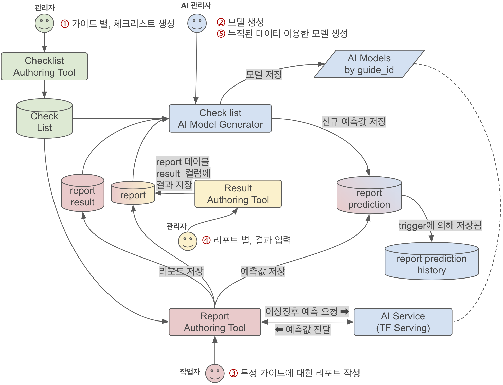

## CheckList AI Architecture



#### 1. 관리자가 `Checklist Authoring Tool`를 통해 가이드별 체크리스트를 작성한다.

작성결과를 쿼리로 검색하면 아래와 같다.
```sql
SELECT	ST.id AS step_id, TK.id AS task_id, AC.id AS action_id, TK.type
FROM	(
            SELECT  id
            FROM    guide
            WHERE   id = 28
        )	AS GD
        JOIN step AS ST ON ST.guide_id = GD.id
        JOIN (
            SELECT  id, step_id, type
            FROM    task
            WHERE   is_analytics = True
        ) AS TK ON TK.step_id = ST.id
        JOIN task_action AS AC ON AC.task_id = TK.id
ORDER BY TK.step_id, TK.id, AC.id -- This should not be changed for AI model
;
```
[ 쿼리 결과 ]

| STEP | TASK | ACTION | TYPE |
|----|-----|-----|---------|
| 67 | 452 | 512 | "RADIO" |
| 71 | 462 | 525 | "CHECK" |
| 71 | 460 | 532 | "RADIO" |
| 71 | 466 | 544 | "CHECK" |
| 71 | 473 | 554 | "RADIO" |
| 71 | 472 | 567 | "RADIO" |
| 70 | 479 | 575 | "RADIO" |
| 70 | 490 | 584 | "RADIO" |
| 68 | 508 | 606 | "RADIO" |

 * 가이드가 변경될시에는, 해당 가이드에 대한 AI 모델을 다시 생성해야 한다.

#### 2. AI 관리자가 `Check list AI Model Generator`를 통해 모델을 생성한다.

물론 실제 사용중인 데이터기반으로 모델생성을 해야하지만, 여건상 가상의 데이터를 생성하여 모델을 생성한다.
```shell
$ python bin/spa-model create --config cfg/spa.cfg --guide-id 28   
```

 - 가이드 1에 대한 모델인 경우 /모델 root/guide_1/1/ 에 저장됨 (/1/ 은 버전정보. 강제적으로 폴더 이름에 숫자만 있어야 함)
 - 가이드 2에 대한 모델인 경우 /모델 root/guide_2/1/ 에 저장됨 

그리고 tf-serving가 읽을수 있도록 추가된 모델을  `models.config` 에 작성한다.
```
model_config_list {
  config {
    name: 'guide_1'
    base_path: 'gs://ai-model-storage/ai/guide_1/'
    model_platform: 'tensorflow'
  }
  config {
    name: 'guide_2'
    base_path: 'gs://ai-model-storage/ai/guide_2/'
    model_platform: 'tensorflow'
  }
}
```

#### 3. 작업자가 `Report Authoring Tool`를 통해 가이드에 대한 리포트를 작성한다. 

작성 완료 버튼 클릭 시, AI Service 에 이상증후 감지를 요청하여 예측값을 받아온다.
```python
# 모델생성과 마찬가지로 step_id ASC, task_id ASC, action_id ASC 순으로 값을 세팅한다.
data = {"instances": [[1,1,1,1,0,0,1,0,0,1,1,1,0,1,1,1,0,1,0,1,1,0,0,1,1,0,1,1]]}
# 요청 주소를 세팅한다.
url = "http://{ip}:{port}/v1/models/{guide}:predict".format(**{'ip': '34.69.98.244', 'port': 8501, 'guide': 'guide_1'})
# 예측값을 요청하고 값을 받아온다.
r = requests.post(url, data=json.dumps(data))
# 예측값은 0 ~ 1
prediction = result['predictions'][0][0] * 100
```
AI 예측값은 참고값으로 사용하고, 리포트 저장시에, `report_prediction`에 AI 예측값을 저장한다.

[ 테이블 report_prediction ] 

| report_id | prediction |
|-----------|------------|
|     28    |  0.32910   | 

`report_prediction` 테이블의 변경내용은 트리거에 의해서 `report_prediction_history` 테이블에 자동적으로 저장된다.

[ 테이블 report_prediction_history ] 

| id | report_id | prediction | history_change_time   | history_change_type |
|----|-----------|------------|-----------------------|---------------------|
| 1  |    28     |     0.3    | 2020년10월15일 17:05:23 |        INSERT       |
| 2  |    28     |     0.3    | 2020년10월15일 17:07:45 |        UPDATE       |
| 3  |    28     |     0.3    | 2020년10월15일 17:13:48 |        UPDATE       |

### 4. 현장 설치에서 문제 발생시, 관리자는 관련된 리포트에 이를 반영한다.

발생한 report는 result 테이블의 result 컬럼에 1로 세팅 (result 컬럼 추가 필요)

[ 테이블 result ]

| id | report_id | result |
|---|----|---|
| 1 | 28 | 0 |
| 2 | 28 | 0 |
| 3 | 28 | 0 |
| 4 | 28 | 0 |
| 5 | 28 | 1 |

### 5. AI 관리자는 누적된 데이터를 이용해서 모델을 업데이트 한다.

2번 방법과 같다.

모델 재생성시, 기존 모델에 업데이트 된다.
